# Proje Nasıl Çalıştırılır?
* Terminal üzerinden **git clone "https://github.com/Kodluyoruz/discord-register-bot.git"** komutunu çalıştırarak repo local'e indirilir. 

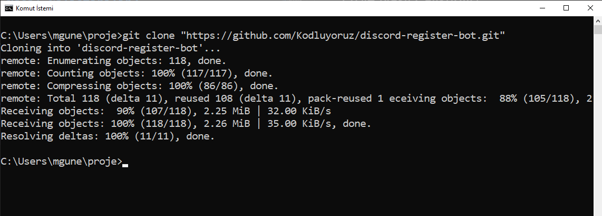
* **cd discord-register-code** komutu kullanılarak projenin bulunduğu klasöre geçilir.
* **code .** komutu kullanılarak proje Visual Studio Code'ta açılır.

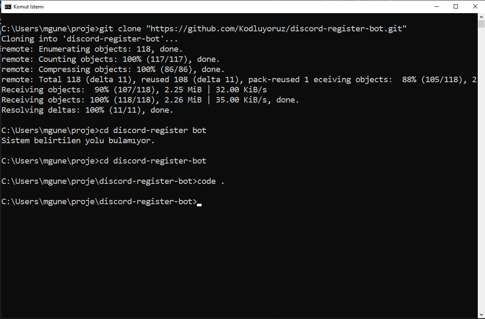
* Visual Studio Code'ta ilk açıldığında proje main branch'indedir. 

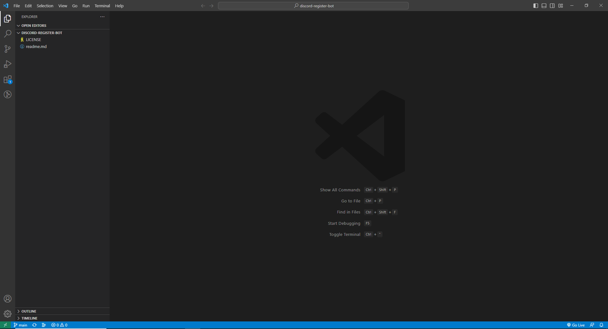
* Branch değiştirmek için code editörünün sol alt tarafında yazılı bulunan **main** yazısına tıklanarak editör içerisinde branch isimlerinin olduğu bir pencere açılır.

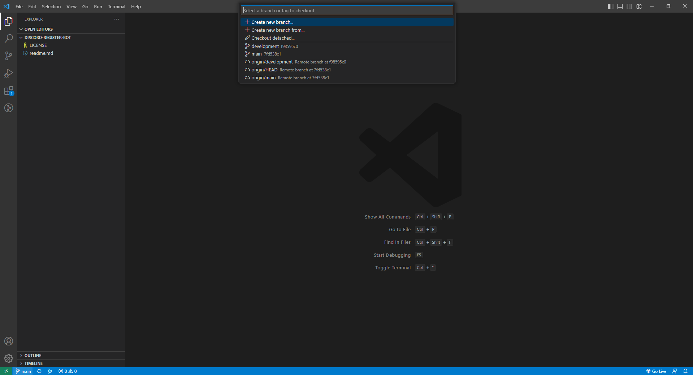
* Bu pencere içerisinde **origin/development** isimli branch seçilerek. Branch değişikliği yapılmış olunur.

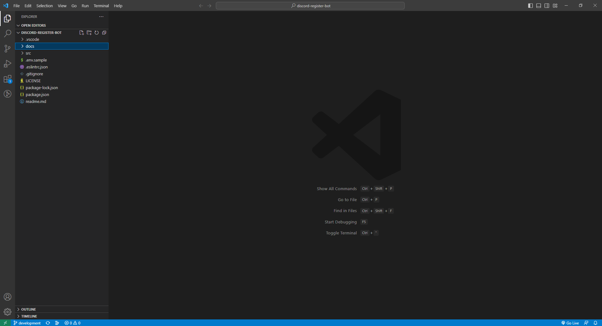
* Editör içerisinden veya daha önce kullandığınız terminal ekranından **npm install** komutu çalıştırılarak proje kütüphaneleri indirilir.

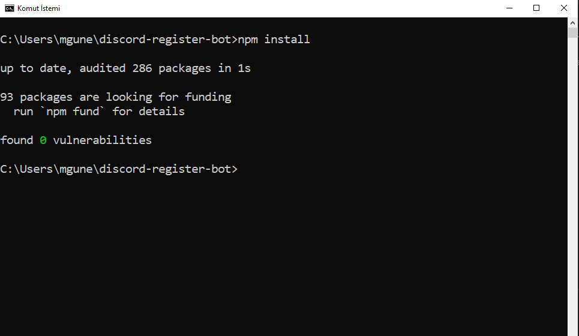
* **.env** isimli bir dosya açarak **.env.sample** dosyasının içerisindekiler kopyalanır.

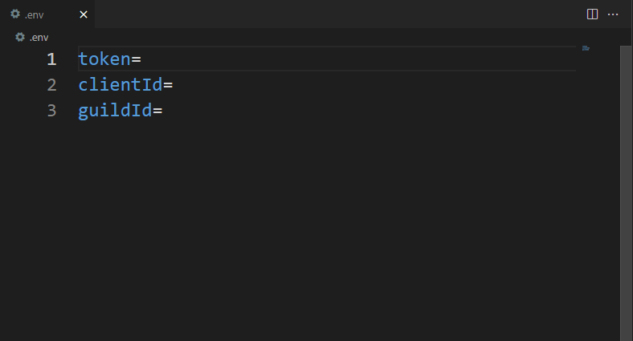
* **https://discord.com/developers/applications** sayfasına giriş yaptığınızda daha önce oluşturmuş olduğunuz aplikasyonlara ulaşabilirsiniz.

* Bu sayfa içerisinden aplikasyon seçerek tıklayınız.

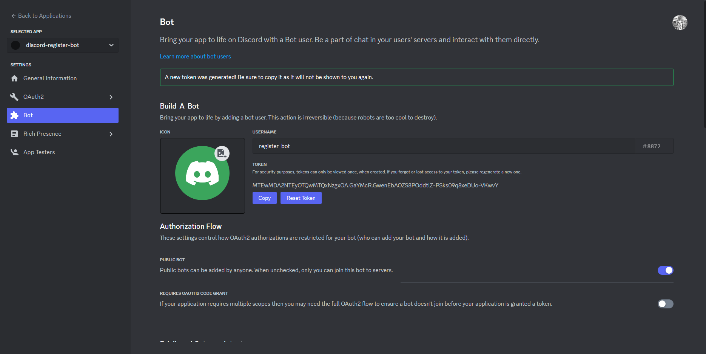
* Aplikasyon sayfasına girdiğinizde sol çubuktaki **Bot** butonuna tıklanarak sayfa içerisinde **Reset Token** butonuna tıklanarak token oluşturulur. 

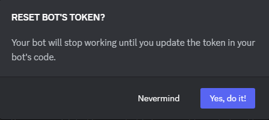
* Oluşturulan token altında bulunan **Copy** butonuna tıklanarak token kopyalanır.

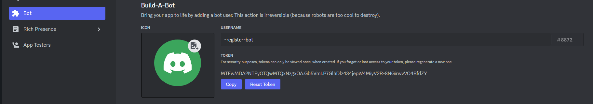
* Kopyalanan token **.env** içerisindeki token değişkeninin yanına yapıştırılır.

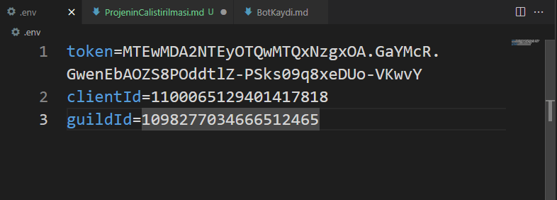
* Terminal ekranından **node .** komutu çalıştırılarak proje ayağa kaldırılmış olur.

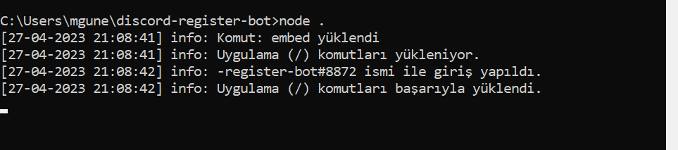
* Bot sunucuda aktifleşmiş ve ilk mesajını göndermiş olur. **Kayıt olmak için tıkla** butonuna tıklayarak botun **Selam Dünya!** yazdırılması sağlanır.

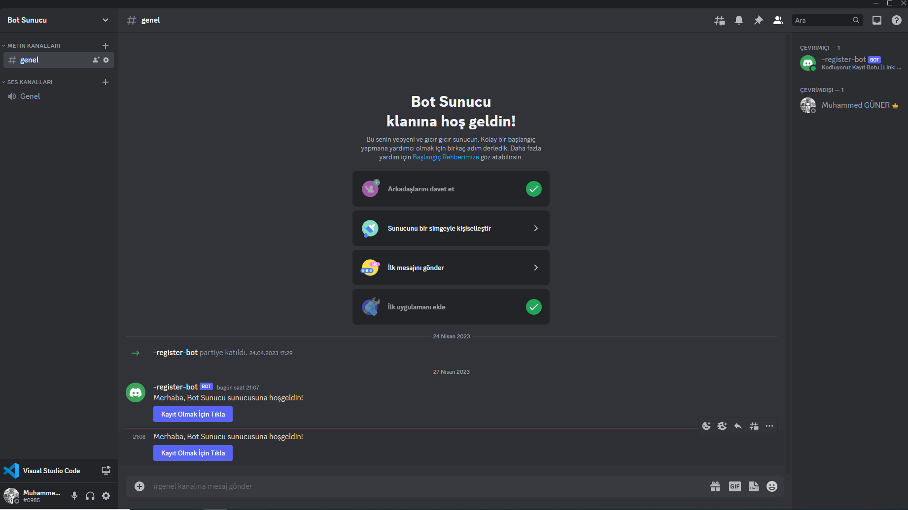
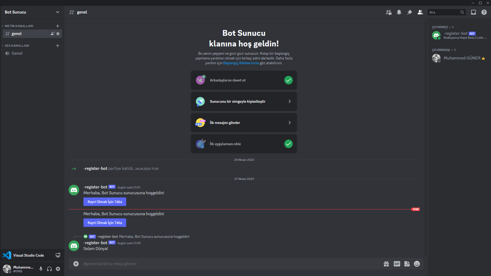