# Discord Register Bot Talimatları 
## İçindekiler
* Discord Sunucusu Nasıl Açılır?
* Discord Aplikasyonu Oluşturma
* Sunucuya Aplikasyon Ekleme
## Discord Sunucusu Nasıl Açılır?
* Uygulama içerisindeki sunucu listesinin gözüktüğü sol çubuktaki **Bir sunucu ekle** ismindeki butonuna tıklanır.

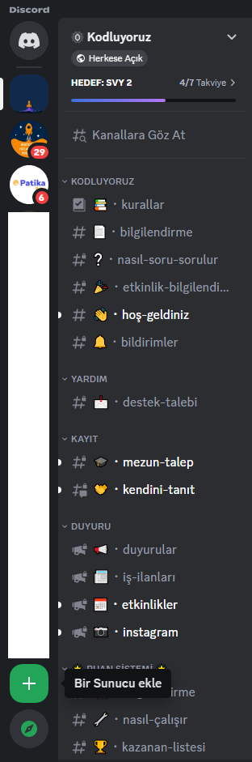
* **Bir sunucu oluştur** isimli ekran karşınıza çıktığında isteklerinize en uygun sunucu oluşturma seçeneği seçilerek devam edilir.

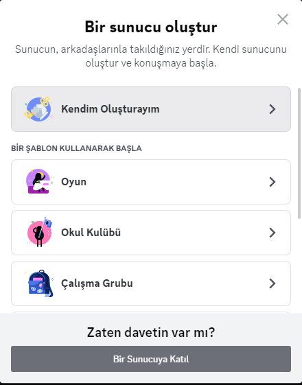
* **Bize sunucundan biraz bahset** isimli ekran karşınıza çıktığında sunucunuzun kullanım amacına göre seçeneklerden biri seçilerek butona tıklanır.

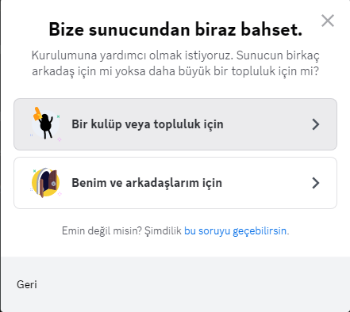
* **Sunucunu özelleştir** ekranında ise sunucu ismi ve görseli işlemleri ayarlanabilmektedir. Bu özelleştirmeler yapıldıktan sonra oluştur butonuna tıklanarak sunucu oluşturma işlemi gerçekleştirilir.

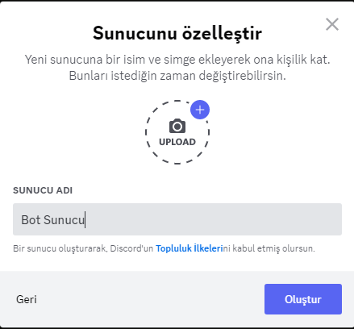
* Discord sunucusu açılmıştır.

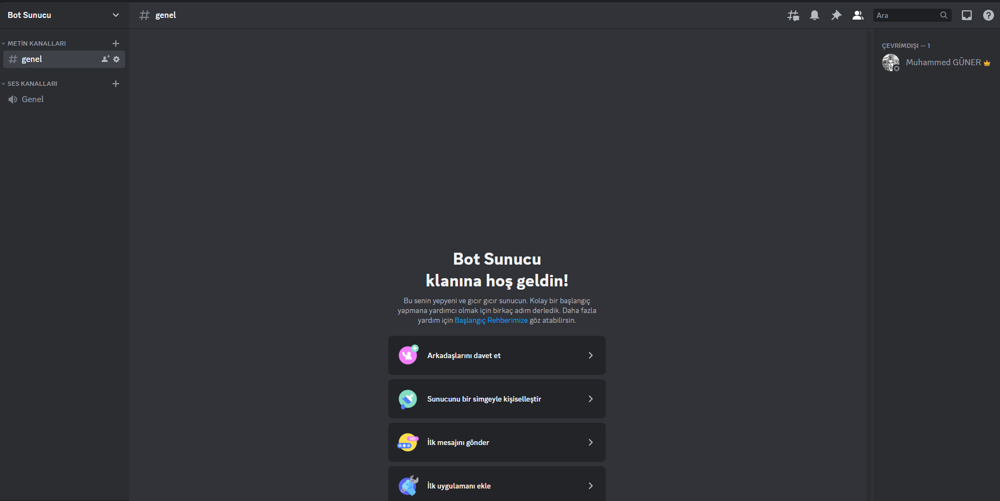

---
## Discord Aplikasyonu Oluşturma
* https://discord.com/developers/applications bağlantısına tıklayarak aplikasyon oluşturma sayfasına gidebiilirsiniz. Eğer daha önceden discord hesabınıza bağlanmadıysanız hesabınıza giriş sayfasına yönlendirecektir.

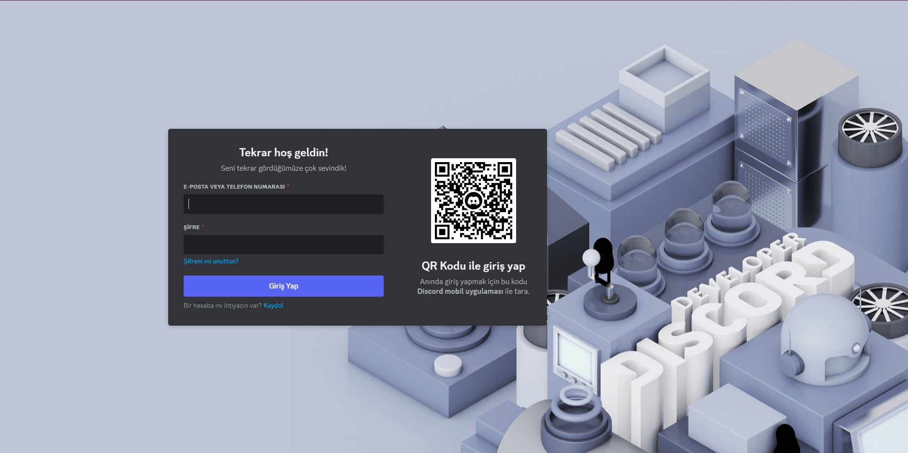
* E-posta ve şifreyi girip discord hesabınıza ulaştığınızda **Developer Portal** ismindeki discord sayfasına girmiş olacaksınız.

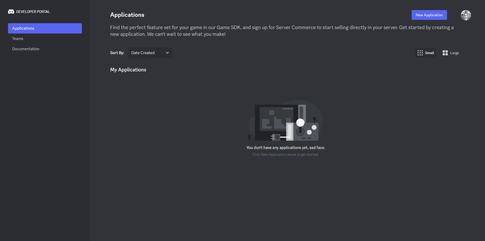
* **Developer Portal** sayfasında sağ üst köşede bulunan **New Application** butonuna tıklayarak yeni bir aplikasyon oluşturabilirsiniz. Hali hazırda daha önceden oluşturmuş olduğunuz aplikasyonlar var ise sol çubukta bulunan **Aplications**'a tıklanarak listelenir.

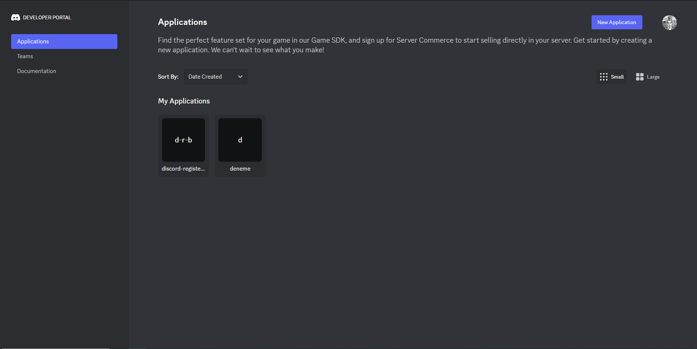
* **New Application** butonuna tıkladığınızda **Create An Application** penceresi açılır. Bu pencere içerisinde aplikasyonunuzun ismini yazarak ve Discord'un aplikasyon sözleşmesini kabul ederek aplikasyon oluşturabilirsiniz.

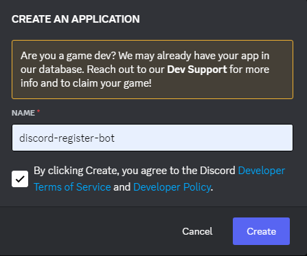
* Aplikasyonunuzu oluşturduktan sonra oluşturduğunuz aplikasyonun sayfasına gitmiş olursunuz. Farklı bir aplikasyon sayfasına gitmek için de sayfa içerisinde sol çubukta bulunan **Selected App** içerisinden farklı bir aplikasyon sayfasına gidebilirsiniz.
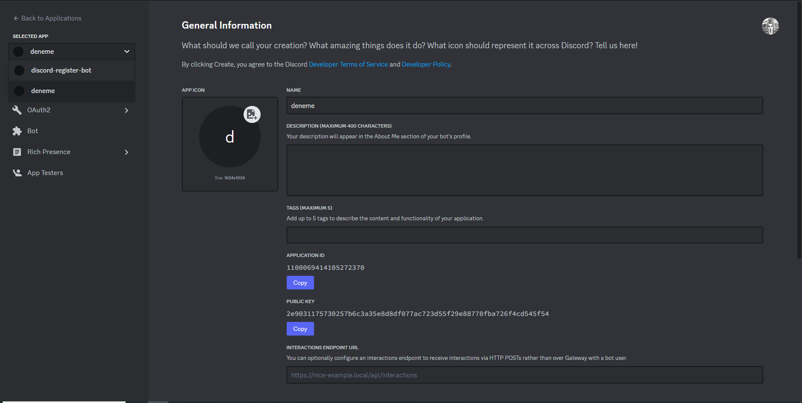
* Bunun haricinde diğer bir yöntem ise; aynı çubuk içerisinde bulunan **Back to Applications** yazısına tıklayarak **Aplications** sayfasına dönmek ve burada listelenen aplikasyonlardan bir seçim yapmak.

---
## Sunucuya Aplikasyon Ekleme
* Aplikasyonlar içerisinden bir aplikasyon seçildikten sonra aplikasyonun ayarlarının ve özelleştirmelerinin yapılabileceği bir sayfa karşınıza çıkar.

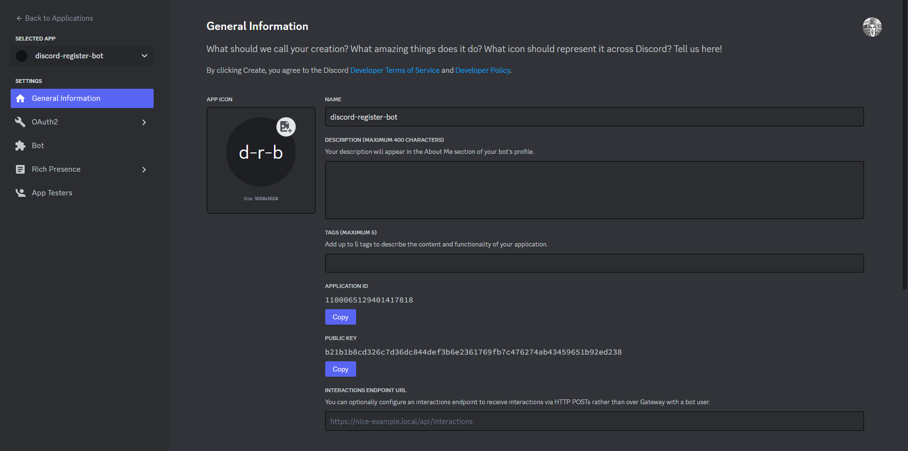
* Sayfa içerisinde sol çubukta bulunan **OAuth2** içerisindeki **Url Generator** butonuna tıkladığınızda **OAuth2 URL Generator** sayfasına geçmiş olursunuz.

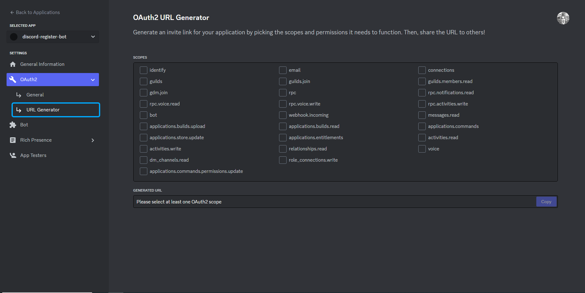
* Bu sayfa içerisinde **Scopes** ismindeki alan içerisindeki **bot** kutucuğunu işaretlerseniz daha öncesinde gözükmeyen **Bot Permissions** bölgesinin açıldığı gözükecektir.

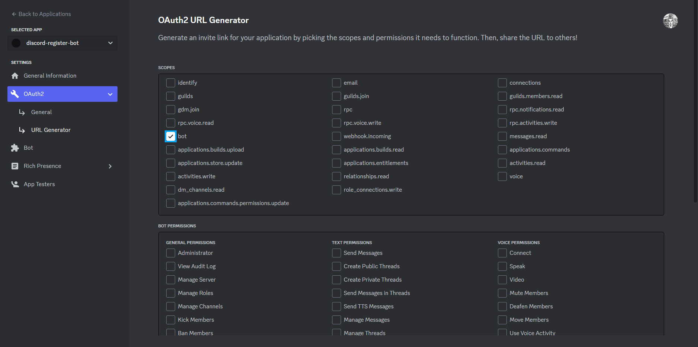
* **Scopes** bölgesindeki **applications.commands** kutucuğu ve **Bot Permissions** bölgesindeki **Administrator** kutucuğu işaretlenirse sayfanın en aşağısında **Generated Url** içerisinde link gözükecektir.

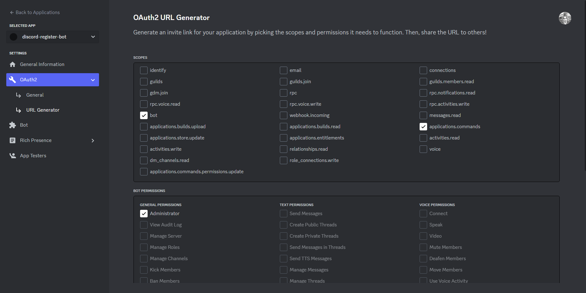
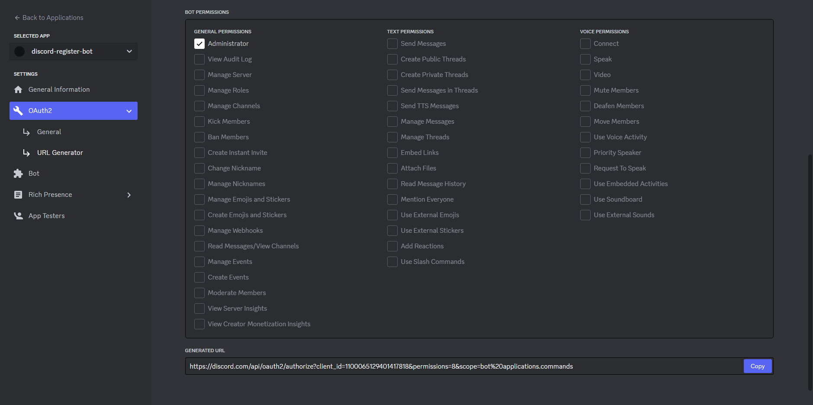
* Bu linkin sonunda bulunan **Copy** butonuna tıklayarak link kopyalanabilir.
* Tarayıcıdan bu linki girdiğinizde sunucuya aplikasyon ekleme sayfasına yönlendirilirsiniz. 

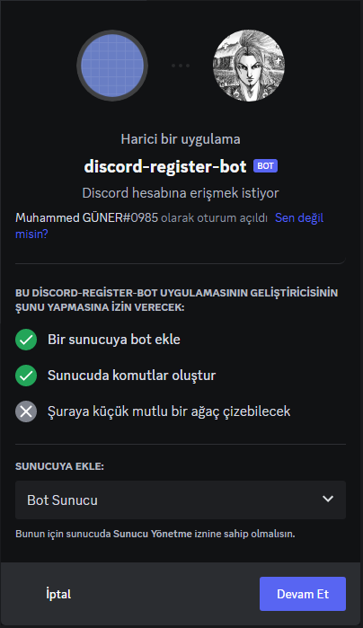
* Bu sayfa içerisineki **Sunucuya Ekle** içerisinden sunucu seçerek ve sonrasında **Yetkilendir** butonuna tıklayarak sunucuya aplikasyon ekleme işi gerçekleşmiş olur.

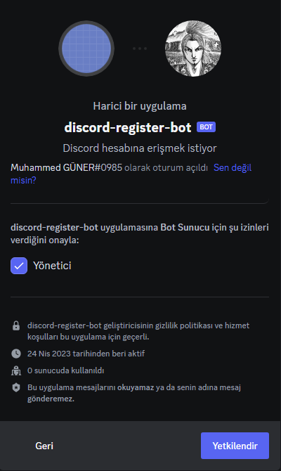
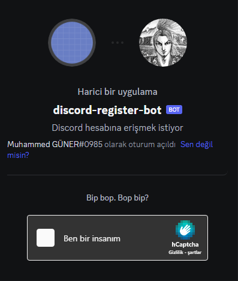
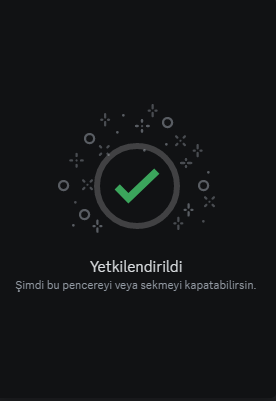
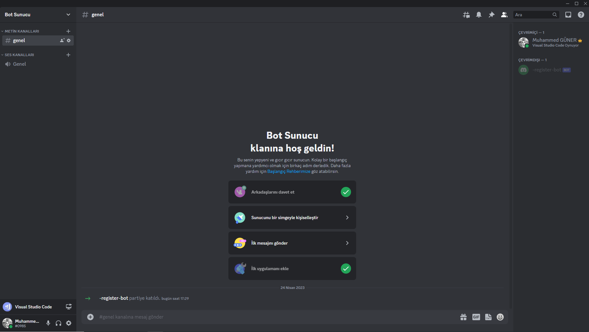